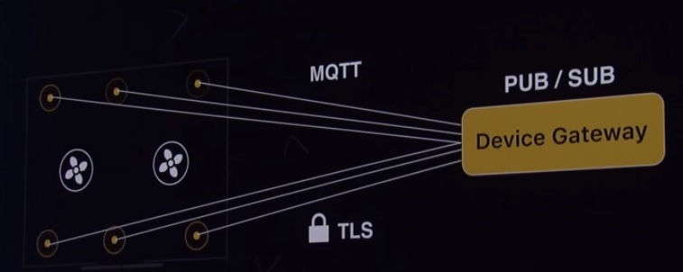

# Device Gateway

The AWS IoT Device Gateway enables IoT devices to securely and efficiently communicate with AWS IoT. IoT devices can communicate with each other via the Device Gateway, even if they are using different protocols.

The example illustrates two Things -- a connected light bulb, and a control unit -- both connected to the Device Gateway. The control unit can publish commands into the Device Gateway, and the light bulb can subscribe and listen for relevant commands.

