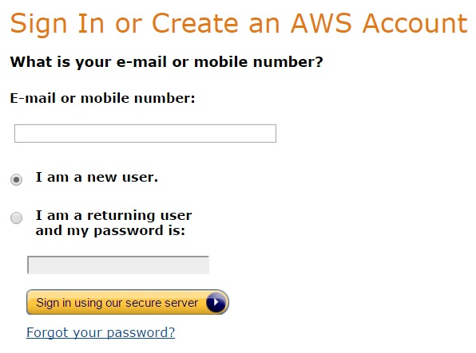
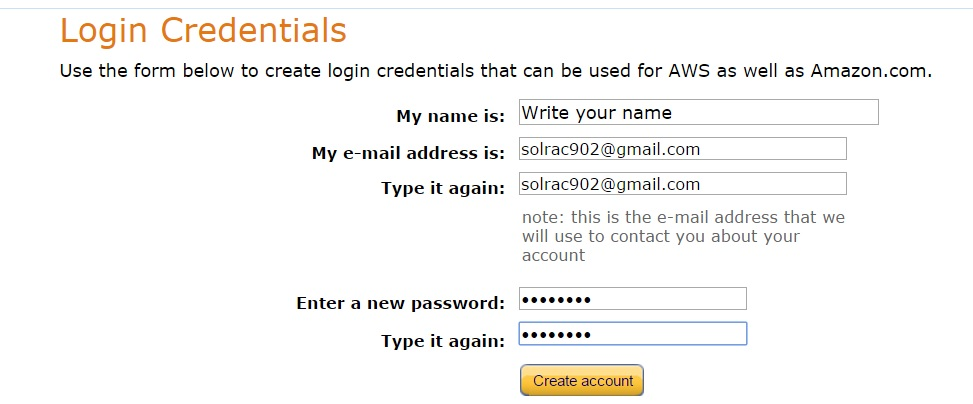
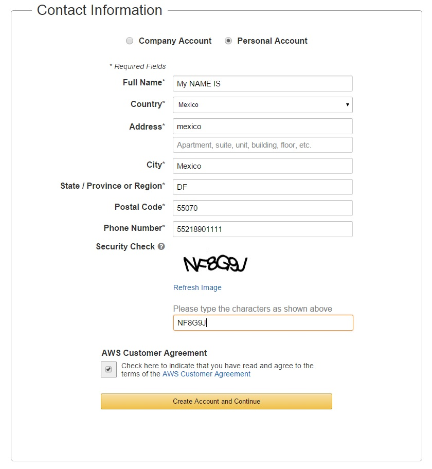
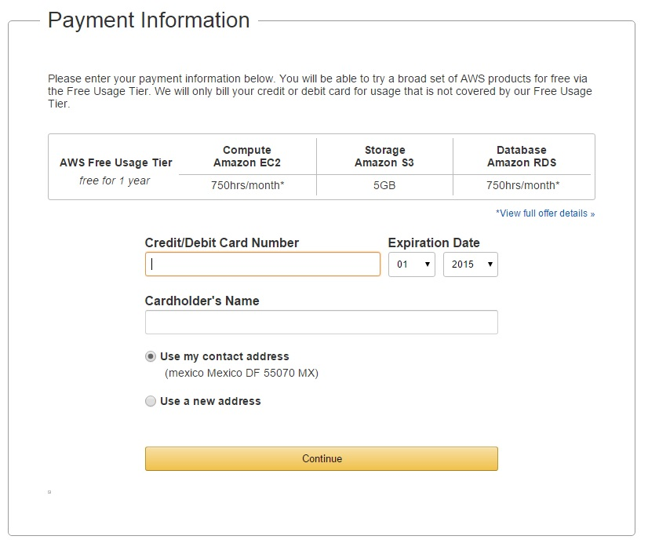
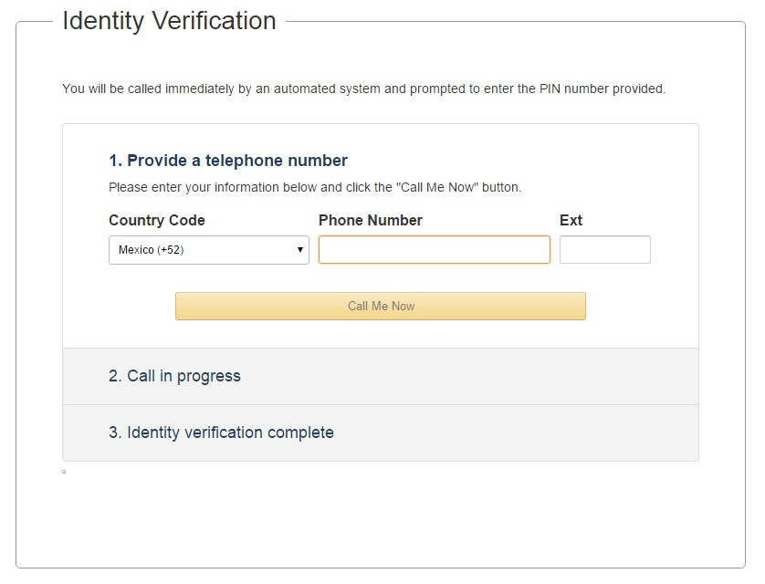
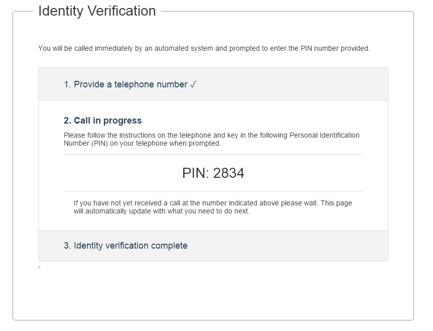
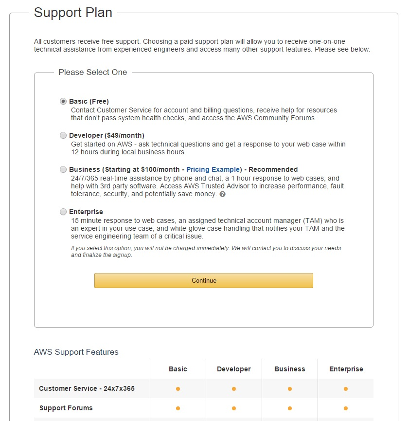
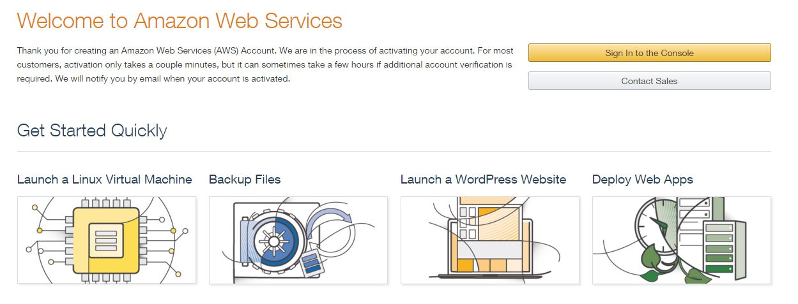

# Lesson 1: Creating an AWS Account

## Please create an AWS Account on the following Link:

[Amazon Web Services Sign In.](https://www.amazon.com/ap/signin?openid.assoc_handle=aws&openid.return_to=https%3A%2F%2Fsignin.aws.amazon.com%2Foauth%3Fresponse_type%3Dcode%26client_id%3Darn%3Aaws%3Aiam%3A%3A015428540659%3Auser%2Fawssignupportal%26redirect_uri%3Dhttps%3A%2F%2Fportal.aws.amazon.com%2Fbilling%2Fsignup%3Fredirect_url%3Dhttps%253A%252F%252Faws.amazon.com%252Fregistration-confirmation%26state%3DhashArgs%2523%26isauthcode%3Dtrue%26noAuthCookie%3Dtrue&openid.mode=checkid_setup&openid.ns=http%3A%2F%2Fspecs.openid.net%2Fauth%2F2.0&openid.identity=http%3A%2F%2Fspecs.openid.net%2Fauth%2F2.0%2Fidentifier_select&openid.claimed_id=http%3A%2F%2Fspecs.openid.net%2Fauth%2F2.0%2Fidentifier_select&action=&disableCorpSignUp=&clientContext=&marketPlaceId=&poolName=&authCookies=&pageId=aws.ssop&siteState=pre-register%2Cen_US&accountStatusPolicy=P1&sso=&openid.pape.preferred_auth_policies=MultifactorPhysical&openid.pape.max_auth_age=120&openid.ns.pape=http%3A%2F%2Fspecs.openid.net%2Fextensions%2Fpape%2F1.0&server=%2Fap%2Fsignin%3Fie%3DUTF8&accountPoolAlias=&forceMobileApp=0&language=en_US&forceMobileLayout=0)

* Type your **E-mail address**.
* **Select** I am a new user._\*\*_:
* Click on the button with the legend: **Sign in our secure button server &gt;** 

## Create your Login credentials for AWS.

Type your **Name** Type your **E-mail address** Type your **Password**

Click on the Button with the legend: **Create account**

Note: If you have an account for [amazon.com](https://amazon.com) you can use it.

**Fill up the Contact information**, you need to select if the account will be for your Company or for your personal use, in this example i will create an account for a personal use.

After you fill all the fields, click on the 

**Create Account and Continue**

 button. 

**Fill up the payment Information.**

**Amazon will contact you, please provide a telephone number.**

After you receive the call from Amazon, please type the PIN number on your telephone. **Note: This is an example the PIN number will be different.**

Please click on the **Continue** button.

**Support Plan**, Amazon have 4 different support plans for this tutorial select the Basic \(free\) option.

Click on the **Continue** button.

Just click on the Sign In to the console button and you can use the AWS Console.

