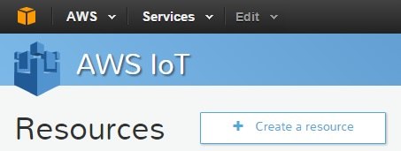
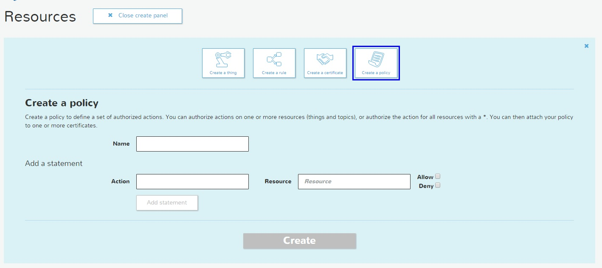
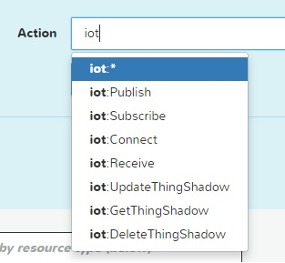
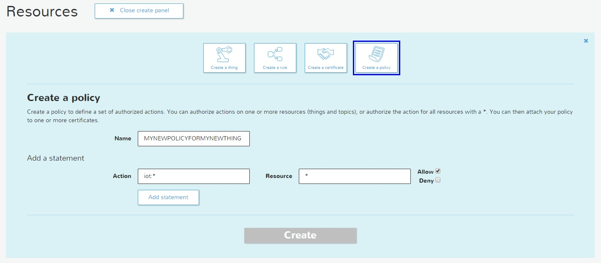
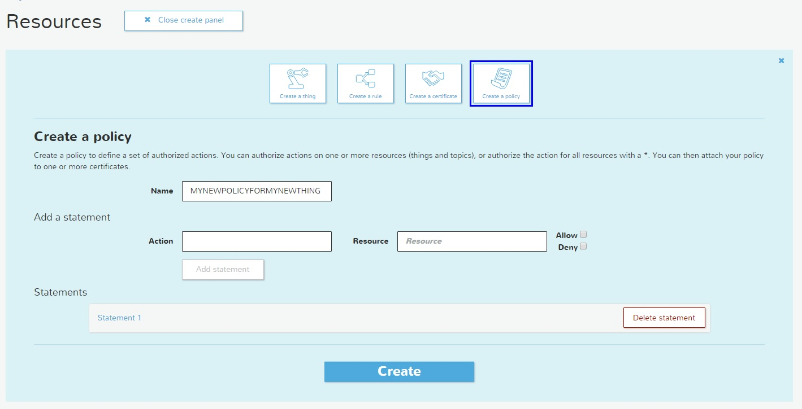
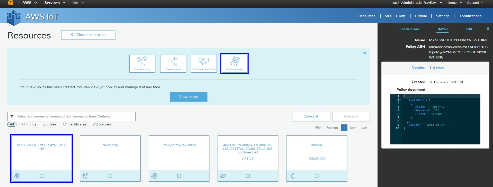

# Lesson 3A: Create a Policy for the IoT device

For the new release of the AWS IoT module you need to create the Policy, we will proceed to do this, first we need to click on the **Create resource** button:

Now select the Icon called **Create a Policy** you will see this:

On the combo box Name, just introduce the name of the policy be descriptive.

On the action Name, select the action that you want to assign to your IoT device. the Following Actions can be configured:

* iot:Publish: The Publish permission is checked every time a publish request is sent to the broker. The Publish action is used to allow clients to publish to specific topic patterns.
* iot:Subscribe: The Subscribe permission is checked every time a subscribe request is sent to the broker. The Subscribe action is used to allow clients to subscribe to topics that match specific topic patterns.
* iot:Receive: The Receive permission is checked every time a message is delivered to a client. Because the Receive permission is checked on every delivery, it can be used to revoke permissions to clients that are currently subscribed to a topic.
* iot:Connect: The Connect permission is checked every time a connect request is sent to the broker. The message broker does not allow two clients with the same client ID to stay connected at the same time. After the second client connects, the broker detects this case and disconnects one of the clients. The Connect permission can be used to ensure only authorized clients can connect using a specific client ID.
* iot:UpdateThingShadow: The UpdateThingShadow permission is checked every time a request is made to update the state of a thing shadow document.
* iot:GetThingShadow:The GetThingShadow permission is checked every time a request is made to get the state of a thing shadow document.
* iot:DeleteThingShadow:The DeleteThingShadow permission is checked every time a request is made to delete the thing shadow document.

On the Resource you can type the resources that can use this policy using ARNs \(Amazon Resource Names its a unique identifier of the AWS resource\)

Select the combo box Allow, to allow the communication with the Rules Engine.

Now click on the Add Statement button

With this new capability you can create different permissions and assign to different IoT devices using the ARNs.

Now just click on the Create button and you will see your new policy ready.

