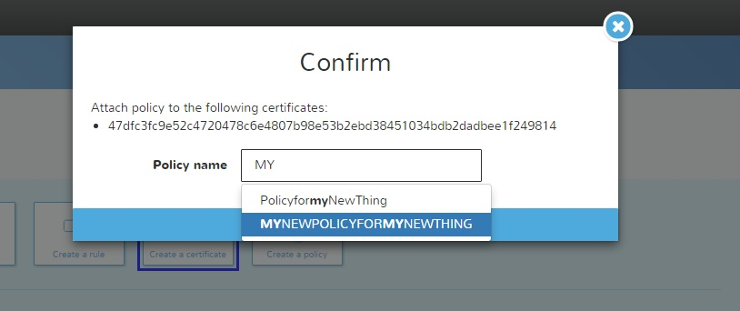

# Lesson 4: Create a Certificate

We must create the certificate to secure the communication between the IoT device and the amazon server\(s\) that will receive the information that our IoT device will create.

Click on the Resource Panel and select the option Create a certificate:

Just Click on the 1 Click certificate create button. AWS will create the certificate to establish the connection with the amazon server and the public and private key. Please download and store it in a safe place we will use it later to configure the Edison device.

This is the example / test certificates that I download, please verify that you have 3 similar files.

After you confirm that you have the 3 files \(one certificate, one public key and one private key, please close the Create Panel.

By default the certificate its INACTIVE, please select your certificate and active it.

* Select the Certificate

  

* Now go to the Actions button and Active it.

  

Now repeat this process and select the following options on the Actions button:

* Attach a policy, we assume that you only have one policy please attach that policy to the certificate. Type the name of your policy and AWS will display your options :\), Click on the Attach button.

  

* Attach a thing, we assume that you only have one IoT device please attach the device to the certificate.Click on the Attach button.

  

This is the result, on the right side you will see the ARN of your certificate and the attached policy and IoT device.

## **NOW its time to configure the Edison, please check the following tutorial to do this... LINK to the tutorial...**

