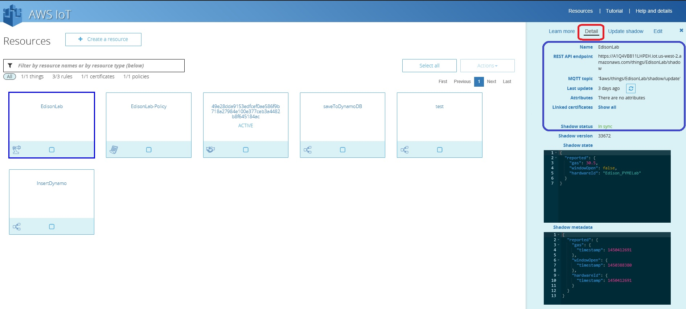
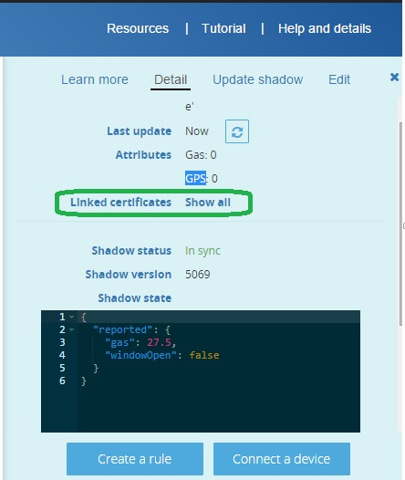
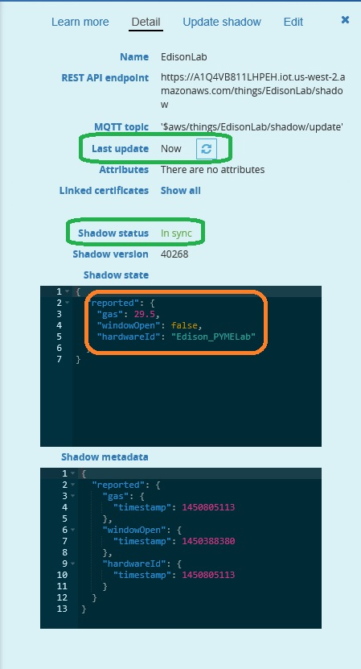
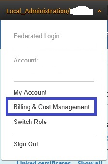
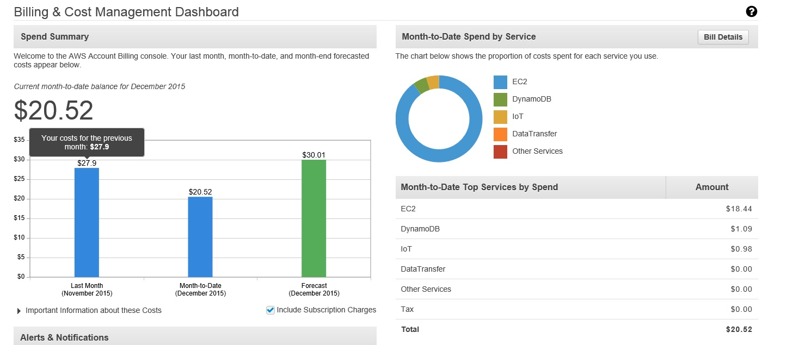

# Lesson 5: Testing the Comunication Edison to AWS

After you finished the configuration of your Edison device, please verify that you are seeing data on the AWS infrastructure.

Return to your Amazon account and select the AWS IoT icon, after that select the IoT that we called Edison Lab you must see this information on the Detail page \(left side of the screen\)

Note: If you are having issues please verify that you are using the information that is inside of the blue square in your code. The Name, rest API endpoint, MQTT topic needs to be the same.

Another important information are the certificates, that you need to use to establish the communication with the AWS infrastructure. You can check which certificates the Iot device is using just clicking on the **Show All** link that is in-front of the Linked certificates option. \(See the green circle on the next image\)

If you are having issues to communicate your device with the Amazon infrastructure please check this link [http://docs.aws.amazon.com/iot/latest/developerguide/diagnosing-connectivity-issues.html](http://docs.aws.amazon.com/iot/latest/developerguide/diagnosing-connectivity-issues.html), remember that the CA.pem certificate needs to be downloaded from here: [https://www.symantec.com/content/en/us/enterprise/verisign/roots/VeriSign-Class 3-Public-Primary-Certification-Authority-G5.pem](https://www.symantec.com/content/en/us/enterprise/verisign/roots/VeriSign-Class%203-Public-Primary-Certification-Authority-G5.pem)

The cert.pem and privateKey.pem are the certificates that you download on the Lesson 4.

You can check the data that your Edison is sending to AWS on the details page:

Check the last update and shadow status information on the page \(Green circles\)

You can also check the information that your IoT device is sending to amazon in this case Edison is sending 3 values , you can see the data on the orange circle.

* gas with a value of 29.5
* windowOpen with a value of false
* hardwareId with the value of Edison\_PYMELab

Each service in Amazon have a cost you can check the cost associated with the services\) that you are using the option Billing & Cost Management located under your account name \(right side of the screen on the top\)

You will see the detail of each service that you are using and the cost.

