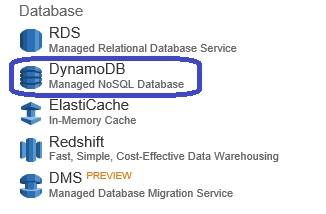
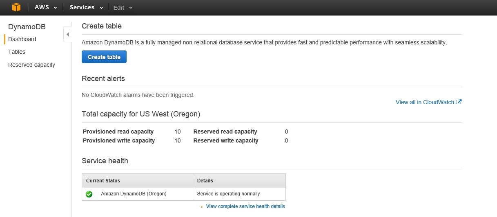
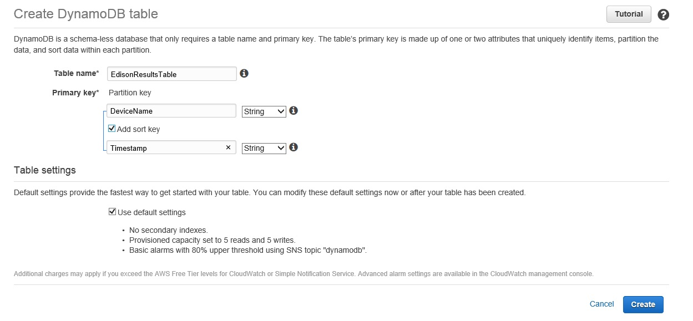
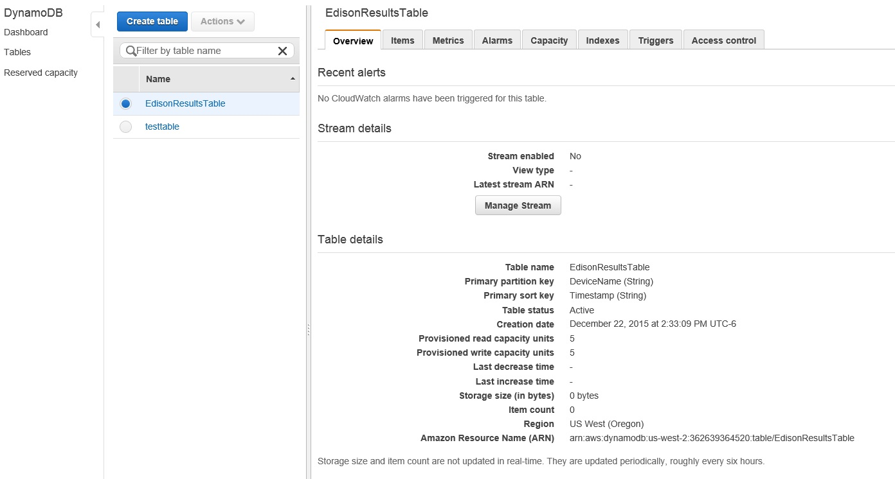

# Lesson 7: Creating a Table to store our results.

After we verify that Edison is sending the information to AWS, we need a database to store this data, in order to create the table we will sue a service called Dynamo DB.

Dynamo DB its a NoSQL database that you can use to store most of the information that your devices are generating, if you want, we will see in the next lessons that we can use another AWS services to store the information or execute scripts based on conditions.

If you want to know more about the Dynamo DB service go here: [https://aws.amazon.com/dynamodb/](https://aws.amazon.com/dynamodb/)

Please return to the Amazon console and select the service Dynamo DB, its under **Databases**:

You will see the Dashboard of the Dynamo DB service, please click on the **Create table** button:

The wizard top create a table on the Dynamo DB service will start, provide the Table name, Primary key and also select the Add sort key option, to create the Timestamp field.

Now click on the **Create** button.

The table EdisionResultsTable will be created in the Dynamo DB service.

This finish the Dynamo DB Lesson.

